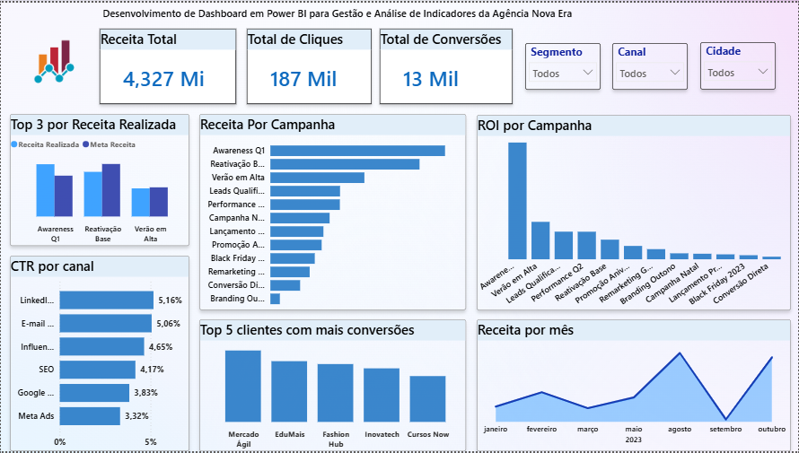

# 📊 Projeto de Análise de Dados – Agência Nova Era

## 📌 Sobre o Projeto

Este projeto foi desenvolvido para demonstrar conhecimentos em Análise de Dados utilizando Excel, SQL e Power BI.

A análise foi realizada com dados de uma agência de marketing fictícia chamada Agência Nova Era, passando pelas etapas de organização dos dados, modelagem do banco de dados, consultas SQL e construção de dashboards para geração de insights estratégicos.

---
## 📸 Dashboard

---

## 🎯 Objetivos

* Organizar e estruturar dados no Excel.
* Criar um banco de dados relacional utilizando SQL.
* Desenvolver consultas para análise de desempenho.
* Construir dashboards interativos no Power BI.
* Gerar indicadores e visualizações para apoiar a tomada de decisões.

---

## 🛠️ Ferramentas Utilizadas

* Excel
* MySQL / SQL
* Power BI

---

## 📂 Estrutura do Projeto

📁 Projeto-Agencia-Nova-Era

├── 📁 Excel

│ ├── Clientes.xlsx

│ ├── Campanhas.xlsx

│ ├── Resultados.xlsx

│ ├── Receita_por_Campanha.xlsx

│ ├── Grafico_Receita.xlsx

│ ├── Base_Analise.xlsx

│ └── Analises.xlsx

│

├── 📁 SQL

│ ├── schema.sql

│ ├── inserts.sql

│ └── queries.sql

│

├── 📁 PowerBI

│ └── dashboard_agencia_nova_era.pbix

│

├── 📁 Imagens

│ └── Dashboard_Agencia_Nova_Era.png

│

└── README.md

---

## 🗄️ Banco de Dados

O banco de dados foi estruturado utilizando SQL, contemplando:

* Criação das tabelas (Schema)
* Inserção dos registros (Inserts)
* Consultas analíticas (Queries)

### Arquivos SQL

* schema.sql
* inserts.sql
* queries.sql

---

## 📈 Dashboard Power BI

O dashboard foi desenvolvido para apresentar os principais indicadores da Agência Nova Era de forma visual e interativa.

### Indicadores Apresentados

* Receita Total: R$ 4,327 milhões
* Total de Cliques: 187 mil
* Total de Conversões: 13 mil
* ROI por Campanha
* Receita por Campanha
* Receita por Mês
* CTR por Canal
* Top 5 Clientes com Mais Conversões
* Comparativo entre Receita Realizada e Meta de Receita

### Principais Análises Desenvolvidas

* Análise da receita gerada por campanha.
* Comparação entre receita realizada e meta estabelecida.
* Avaliação do retorno sobre investimento (ROI) das campanhas.
* Monitoramento da evolução da receita ao longo dos meses.
* Identificação dos canais com maior taxa de cliques (CTR).
* Identificação dos clientes com maior número de conversões.
* Aálise de desempenho por segmento, canal e cidade.

---

## 👩‍💻 Autora

Letícia Felix

Estudante de Análise e Desenvolvimento de Sistemas, com foco em Dados e Business Intelligence.

### Competências

* Excel
* SQL
* MySQL
* Power BI
* Python
* Análise de Dados
* Business Intelligence
* Dashboards

---

## ⭐ Objetivo

Este projeto foi desenvolvido para compor meu portfólio profissional, demonstrando habilidades em tratamento de dados, modelagem de banco de dados, consultas SQL e criação de dashboards voltados para análise de desempenho empresarial.

